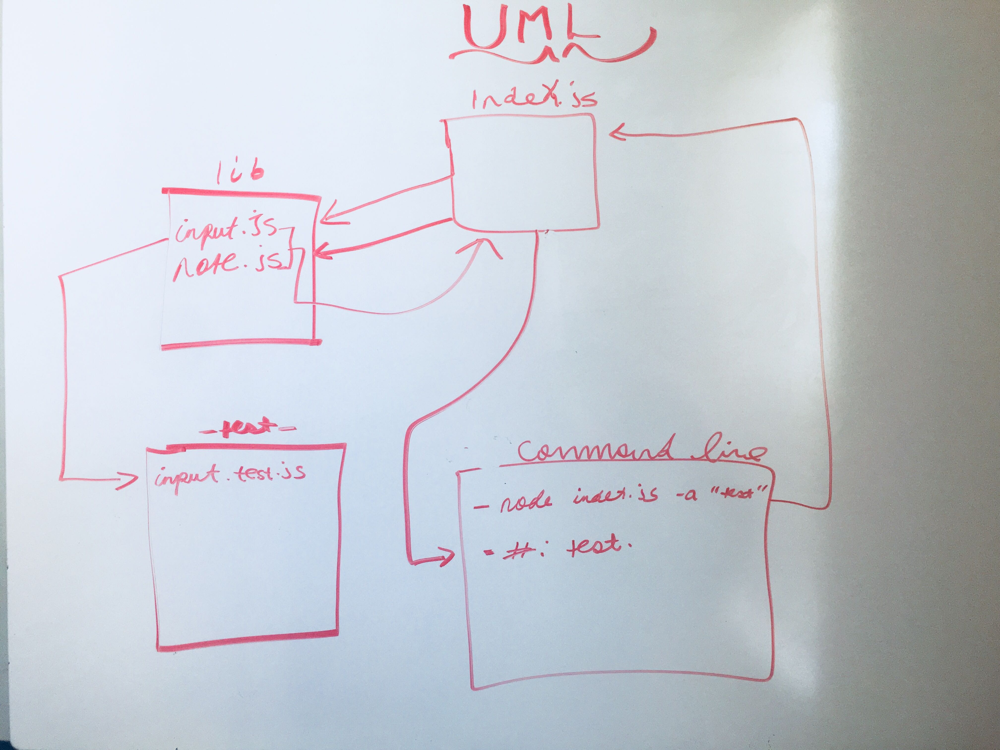
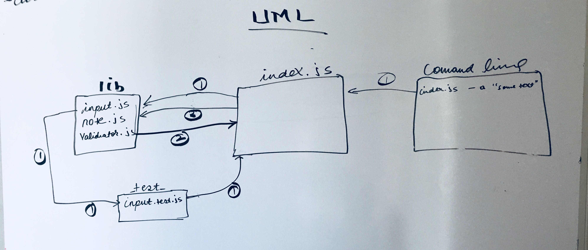

# LAB - Class 01

## Node Eco-system

### Author: Eyob Tamir

### Links and Resources

- [PR Link](https://github.com/eyobtamir-401n16/notes/tree/daythree)

### Setup

#### How to initialize/run your application (where applicable)

- e.g. `node index.js`

#### Tests

- How do you run tests?     npm test.
- Any tests of note?  Yes.
- Describe any tests that you did not complete, skipped, etc. Its all completed

#### UML

# LAB - Class 02

## Node Eco-system

### Author: Eyob Tamir

### Links and Resources

- [PR Link](https://github.com/eyobtamir-401n16/notes/tree/daythree)

### Setup

#### How to initialize/run your application (where applicable)

- e.g. run `node index.js`

#### Tests

- How do you run tests?   run   `npm test`.
- Any tests of note?  Yes.
- Describe any tests that you did not complete, skipped, etc. Its all completed

#### UML

